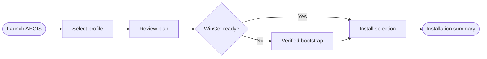

<div align="center">

# AEGIS

**One command. Every runtime. Game ready.**


[](https://github.com/Marek-Codex/AEGIS/actions/workflows/validate.yml)


**Automated Essentials for Gaming Installation System**

</div>

AEGIS prepares Windows gaming systems with curated runtimes, compatibility
components, and optional applications. It uses explicit package identifiers,
checks installed state through WinGet, supports modern and legacy profiles, and
provides repeatable unattended installation.

No debloat rituals. No registry folklore. No suspicious "400% FPS" power plan.
Pick a profile, inspect the plan, and let AEGIS handle the dependencies.

> AEGIS is under active development. Review the installation plan before using
> it on a production system.

## How it works



## Run AEGIS

### PowerShell one-liner

```powershell
irm https://github.com/Marek-Codex/AEGIS/raw/refs/heads/main/Install.ps1 | iex
```

Do not run remote scripts you have not inspected. Pin the URL to a release tag
or commit SHA for reproducible deployments.

### Downloadable BAT

Download and run [`Install.bat`](Install.bat). It works as a standalone
bootstrapper:

1. If `Install.ps1` is beside the BAT, it runs that local copy.
2. Otherwise, it downloads the current `Install.ps1` from the AEGIS repository
   into `%TEMP%` and runs it.

### Direct PowerShell

```powershell
Set-ExecutionPolicy -Scope Process Bypass
.\Install.ps1
```

## Profiles

| Profile | Selection |
|---|---|
| `Modern` | Current gaming runtimes |
| `Legacy` | Modern baseline plus legacy compatibility runtimes |
| `Full` | Every curated runtime and compatibility component |
| `Custom` | Only explicitly selected packages and groups |

Legacy and Full intentionally include the Modern baseline. Older games and
launchers can still depend on current components.

## Optional groups

- Java
- Utilities
- Browsers
- Launchers
- Communication
- Capture
- Monitoring
- Modding

Package names remain visible in the installation plan before any changes occur.
Interactive runs support arrow keys or WASD, Space to toggle optional groups,
and Enter to continue. Redirected and noninteractive terminals automatically
fall back to numbered prompts.

## Examples

```powershell
# Preview without changing the system
.\Install.ps1 -Profile Full -IncludeGroup Utilities,Java -DryRun

# Modern runtimes and utilities
.\Install.ps1 -Profile Modern -IncludeGroup Utilities

# Full unattended runtime installation using the newest published WinGet build
.\Install.ps1 -Profile Full -WinGetChannel Newest -Unattended

# Install selected items only
.\Install.ps1 -Profile Custom `
  -IncludePackage M2Team.NanaZip,Devolutions.UniGetUI
```

## WinGet channels

| Channel | Behavior |
|---|---|
| `Stable` | GitHub's designated latest stable release |
| `Preview` | Most recently published prerelease |
| `Newest` | Most recently published release, stable or prerelease |

When an update is needed, AEGIS downloads the matching Desktop App Installer
bundle and dependency archive from the official
[`microsoft/winget-cli`](https://github.com/microsoft/winget-cli) release. The
bundle and extracted AppX dependencies must have valid Microsoft signatures
before AEGIS installs them.

Use `-SkipWinGetUpdate` to retain a working installed version.

## Included selections

### Modern

- Microsoft Visual C++ v14 Redistributable
- Microsoft .NET Desktop Runtime 8
- Microsoft .NET Desktop Runtime 10
- DirectX End-User Runtime
- OpenAL
- Microsoft Edge WebView2 Runtime

### Legacy compatibility

- Microsoft Visual C++ 2005–2013 Redistributables
- Microsoft .NET Desktop Runtime 3.1, 5, 6, and 7
- Microsoft XNA Framework Redistributable
- NVIDIA PhysX
- NVIDIA PhysX Legacy
- DirectPlay

### Requested optional applications

- Amazon Corretto 25 JDK
- NanaZip
- UniGetUI
- Brave Beta

The manifest also contains optional launchers, communication, capture,
monitoring, and modding applications. Run:

```powershell
.\Install.ps1 -ListPackages
```

to see the complete current list.

## Safety and behavior

- `-DryRun` performs no installation, WinGet update, or Windows feature change.
- Downloaded WinGet packages are signature-checked.
- Exact package IDs and the official WinGet source are used.
- Each package is retried independently.
- Logs are written to `%TEMP%` unless `-LogPath` is supplied.
- A nonzero exit code is returned for fatal or partial failures.
- DirectPlay requests elevation only when it needs to be enabled. Unattended
  runs must already be elevated.
- A restart is never initiated automatically.
- Installed/current package state is determined from WinGet exit codes rather
  than localized output text.
- BAT downloads use a unique temporary directory and clean it up after use.

## Exit codes

| Code | Meaning |
|---:|---|
| `0` | Completed successfully |
| `1` | Fatal bootstrap or configuration error |
| `2` | One or more selected items failed |

## Architecture

```text
Install.bat        Standalone bootstrap and local-script entry point
Install.ps1        UI, profiles, manifest, WinGet bootstrap, and install engine
AEGIS.txt          Source artwork
tests/             Non-destructive validation
.github/workflows  Windows PowerShell, PowerShell 7, and release automation
```

The BAT remains deliberately small. Installation policy, package selection,
logging, retries, and verification live in one PowerShell implementation so
every entry path behaves consistently.

## Credit

Conceptually inspired by
[PC-Gaming-Redists](https://github.com/harryeffinpotter/PC-Gaming-Redists) by
[`@harryeffinpotter`](https://github.com/harryeffinpotter).

AEGIS is an independent clean-room implementation. It shares no source code
with PC-Gaming-Redists.
